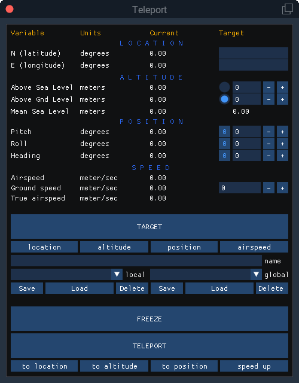

# teleport
 
This FlyWithLua script can give ability to:
<ul>
<li>Move aircraft at any location</li>
<li>Set any altitude from sea or ground level</li>
<li>Change aircraft position</li>
<li>Set aircraft true airspeed</li>
<li>Save all this data and name it for faster use</li>
</ul>
<h2>How it works?</h2>
<ul>
<li>Assign a button or key to open teleport menu</li>
<li>Set location and position you need to teleport at target column</li>
<li>Name your favorite point and save</li>
<li>Select favorite point and load</li>
<li>You can freeze aircraft at current location and position, but sim time wiil not stop (<b>beware of moving aircraft on long range!</b>)</li>
</ul>